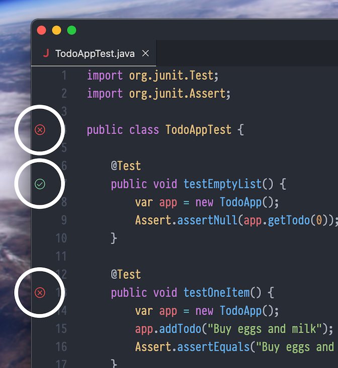

# Lab Exercises for E-22/S-22

In these lab exercises, we will put the concepts from lecture into action.
See the `README.md` files in each subdirectory.

<details>

<summary>Lecture schedule</summary>

### Lectures

The topics are subject to change.

| week   | date    | lecture/lab      | topics                                           |
| ------ | ------- | ---------------- | ------------------------------------------------ |
| week 1 | June 24 | Lecture 1        | Intro, ADTs and object-oriented programming      |
|        | June 26 | Lecture 2        | Recursion and backtracking                       |
| week 2 | July 1  | Lecture 3        | Sorting and algorithm analysis (1/2)             |
|        | July 3  | Lecture 4        | Sorting and analysis (2/2), linked lists (1/2)   |
| week 3 | July 8  | Lecture 5        | Linked lists (2/2); lists, stacks & queues (1/2) |
|        | July 10 | Lecture 6        | Lists, stacks and queues (2/2)                   |
| week 4 | July 15 | _Midterm exam_   |                                                  |
|        | July 17 | Lecture 7        | Binary trees, Huffman encoding                   |
| week 5 | July 22 | Lecture 8        | Binary search trees, balanced search trees       |
|        | July 24 | Lecture 9        | Heaps and priority queues                        |
| week 6 | July 29 | Lecture 10       | Hash tables, graphs (1/2)                        |
|        | July 31 | Lecture 11       | Graphs (2/2)                                     |
| week 7 | Aug 5\* | _Review session_ | Practice final exam                              |
|        | Aug 7   | _Final exam_     |                                                  |

\* Indicates a problem set due date

</details>

<details>

<summary>Lab schedule</summary>

### Labs

The topics are subject to change.

| day | date      | lecture/lab      | topics                                                  | bonus                    |
| --- | --------- | ---------------- | ------------------------------------------------------- | ------------------------ |
| T   | June 25   | Lab 1            | `ArrayBag`, test-driven development                     | To-do list app           |
| R   | June 27   | Lab 2            | `removeCapitals()`, `fib()`, debuggers                  | Combination sum          |
| T   | July 2\*  | Lab 3            | Matrix multiplication, quadratic sorts                  | Sorting visualizer       |
| R   | July 4    | Lab 4 (recorded) | big O from data, linearithmic sorts, radix sort         |
| T   | July 9\*  | Lab 5            | `StringNode`: recursion vs. iteration                   |
| R   | July 11   | _Review session_ |                                                         |
| T   | July 16   | Lab 6            | searching lists, generics, `isBalanced()`               |
| R   | July 18   | Lab 7            | Binary trees, `PreorderIterator`                        | `ExprTree`               |
| T   | July 23\* | Lab 8            | Search trees, balance, 2-3 trees, B-trees               | Red-black trees          |
| R   | July 25   | Lab 9            | Heaps, heapsort, hash tables                            | kth largest number       |
| T   | July 30\* | Lab 10           | Double hashing, DFS & BFS (on graphs)                   | Longest unique substring |
| R   | Aug 1     | Lab 11           | Minimum spanning trees, shortest path, topological sort | Maze solver              |

\* Indicates a problem set due date

</details>


## Installing Java and Gradle

To run the code in this repository, you need Java Development Kit 21 and Gradle 8.7.

If you downloaded the [Coding Pack for Java][coding-pack], you should already have JDK 21.
When you install the VS Code extension for Gradle, or run the [Gradle wrapper][gradle-wrapper]
`./gradlew`, it should automatically install Gradle 8.7.

The code for each lab has its own [Gradle][gradle] project. Gradle is an
industry-standard build and dependencies tool for Java. It allows you to easily
download and use open source third-party libraries, like [JUnit][junit].


### VS Code extension

If you use VS Code, install the [extension for Gradle][gradle-extension].
We also recommend moving the Test Explorer to your secondary Side Bar.
This layout allows you to browse files on the left, edit code in the center,
and see the results of tests on the right.


### Getting the code

The code is [hosted on GitHub](https://github.com/abreen/s22-labs).
If you use the [VS Code Extension for GitHub][github-extension], you can
easily download the code by opening a new window and clicking "Clone
Repository". Then type the repository name: `abreen/s22-labs`

On the command line, `git clone https://github.com/abreen/s22-labs.git` will work.


### Build, test, and run

VS Code should automatically load the Gradle projects and allow you to click the
Run / Debug button (or press F5) from any `.java` file with a `main()` method.

You may also use the [Gradle wrapper][gradle-wrapper] (the `./gradlew` command)
to invoke any of these "run" tasks to compile and run the code for the
appropriate exercise:

    ./gradlew :lab1:run
    ./gradlew :lab1-solution:run
    ./gradlew :lab2:run
    ./gradlew :lab2-solution:run
    ./gradlew :lab3:run
    ...

(On Windows, use `gradlew.bat` instead.)

- To compile the code but not run it, do `./gradlew :labX:build`.
- To run the tests, use `./gradlew :labX:test`.


## Testing

You can run tests using the "test" task by doing `./gradlew :labX:test`.

You can also run tests directly from VS Code by clicking the gutter icons:




### JUnit

> [!NOTE]
> Both JUnit 4 and JUnit 5 are in common usage, but there are significant
> differences between them. We are using JUnit 4.

We use the industry-standard [JUnit 4][junit] framework.

- Test files must be located in `src/test/java`, not `src/main/java`
- Test files include these two `import` statements to give you access to the
  `@Test` annotation and the `Assert` class:
  ```java
  import org.junit.Test;
  import org.junit.Assert;
  ```

Here is a brief summary of the imported members (your editor
or IDE can provide inline documentation):

- The `@Test` annotation: put this before test case (a method
  that calls your code and makes assertions)
- `Assert.assertNull(value)` will fail the test if the supplied
  value is not `null` (also see `assertNotNull()`)
- `Assert.assertTrue(booleanValue)` will fail the test if the
  supplied value is not `true`
- `Assert.assertFalse(booleanValue)` will fail the test if the
  supplied value is not `false`
- `Assert.assertEquals(expected, actual)` asks JUnit to compare
  the given values and if `actual` doesn't equal `expected`, the
  test fails (also see `assertNotEquals()`); note that the expected
  value should be passed **first**
- `Assert.assertThrows()` takes an `Executable` (a block of code)
  and fails the test if the code doesn't throw a specific exception
- `Assert.assertArrayEquals()` is like `assertEquals()`, but
  compares invidivual array elements

You can also import `org.junit.Before` and `org.unit.After`,
annotations that tell JUnit to run a method before and after each `@Test` method
runs, like this:

```java
private ArrayBag bag;

@Before
public void setup() {
    bag = new ArrayBag(25);
}

@Test
public void test() {
    bag.add("foo");
    Object[] data = bag.toArray();
    Assert.assertEquals("foo", data[0]);
}
```

Here, we set the `bag` reference to a completely new bag before each `@Test`
method runs. `@After` could also be used to set `bag` to `null` or do any other
such cleanup.


[gradle]: https://gradle.org/
[sdkman]: https://sdkman.io/
[gradle-extension]: https://marketplace.visualstudio.com/items?itemName=vscjava.vscode-gradle
[junit]: https://junit.org/junit4/
[coding-pack]: https://code.visualstudio.com/docs/languages/java#_install-visual-studio-code-for-java
[gradle-wrapper]: https://docs.gradle.org/current/userguide/gradle_wrapper_basics.html
[github-extension]: https://code.visualstudio.com/docs/sourcecontrol/github
